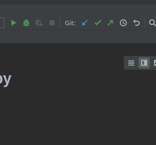
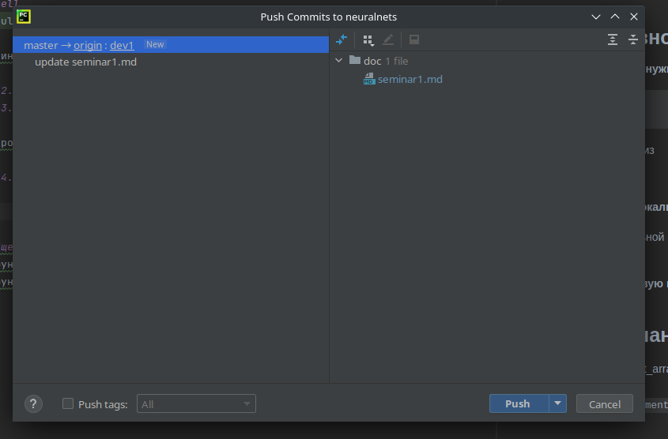
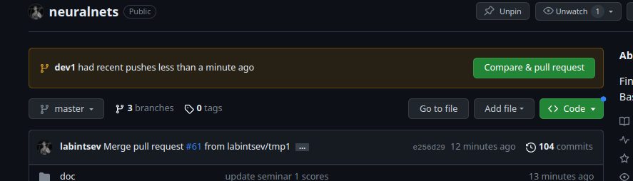
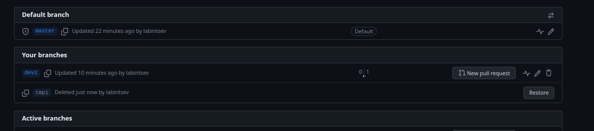
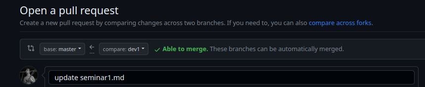
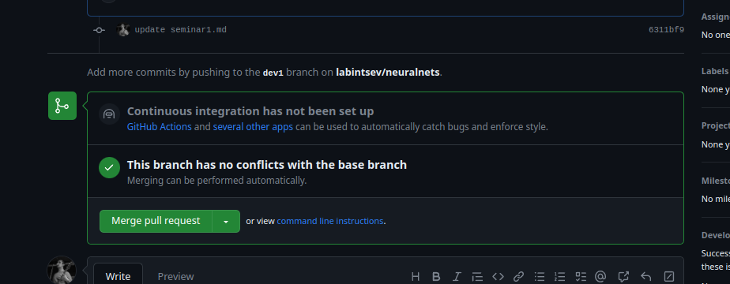

# Семинар 1. Разминка с numpy, pycharm, git

Не забудьте защитить ветку `master` от прямых коммитов в настройках на сайте гитхаба.  

## Правильно вносите изменения в свой репозиторий:  
#### 1. Перед правкой кода нужно синхронизировать локальный репозиторий с remote:  
```shell
git pull
```
Или синяя стрелочка вниз  

#### 2. Решаете задачи.  

По-хорошему, на локальной машине тоже нужно создавать отдельную ветку, 
но на несложных правках можно обойтись и решать прямо в `master`.

#### 3. Делаете коммит в локальную ветку `master`. 

Зеленая галочка в интерфейсе pycharm. 
Обязательно добавляйте комментарии к коммиту на английском языке. 

#### 4. Делаете `push` в новую ветку на удаленный репозиторий (remote). 



Название новой ветки произвольное, например `dev1`. 
После слияния ветки `dev1` и `master` временную ветку нужно удалить. 

#### 5. На сайте гитхаба делаете `pull request` 
Предложение сравнить новую ветку `dev1` с `master` и сделать `pull request` появляется автоматически.  



Если что-то пошло не так, можно открыть страницу с ветками проекта, нажав на ссылку `branches`. 
Откроется страница с ветками проекта, где напротив нужной ветки нужно нажать кнопку `New pull request`



ВНИМАНИЕ! По умолчанию предлагается сделать `pull request` в базовый репозиторий, т.е. `labintsev/neuralnets`. 
Здесь нужно выбрать ваш собственный репо. 



#### 6. После проверки гитхабом на отстутствие конфликтов, будет предложено сделать `Merge pull request`. 
Все изменения (commits) из ветки `dev1` после мерджа попадут в ветку `master`. 
После слияния ветка `dev1` больше не нужна, нужно ее удалить. 



## Общее замечание:  
- в функции broadcast_array использован `np.tile()` вместо замечательного свойства [библиотеки](https://numpy.org/doc/stable/user/basics.broadcasting.html).
- в функции `get_elements` использованы циклы, что конечно вычислительно не эффективно.

